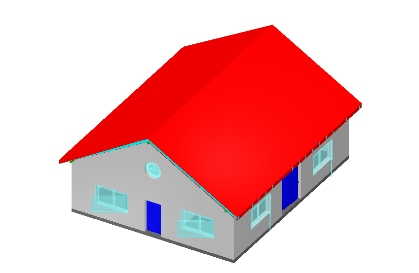
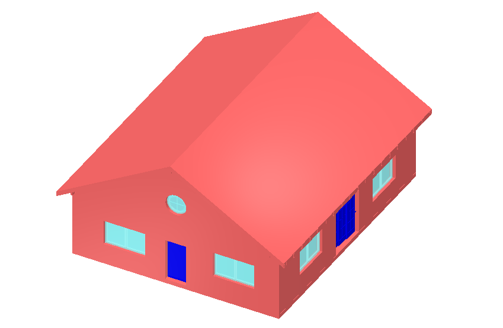
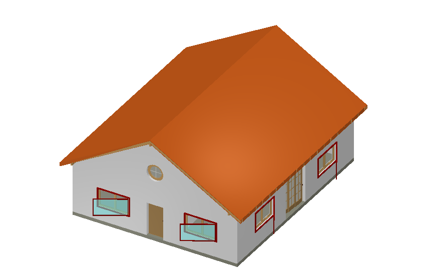
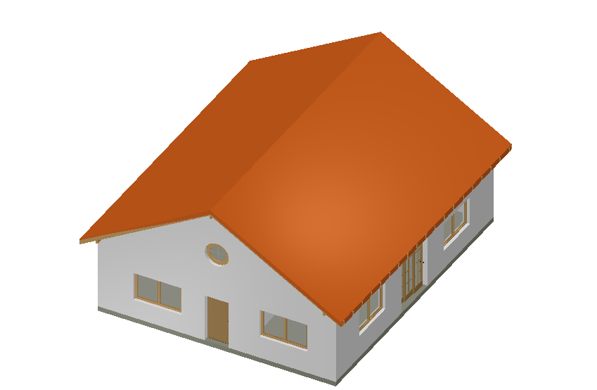

# IFC to CityGML 3.0 Converter

This is a Python tool for converting Industry Foundation Classes (IFC) building models to CityGML 3.0 format. This converter extracts 3D geometry and semantic information from IFC files and maps them to the corresponding CityGML 3.0 Building module classes. It supports all IFC versions (tested with BIM datasets given IFC2.3, IFC4, IFC4.3).

The tool converts the individual building components from the IFC model to volumetric `<bldg:BuildingConstructiveElement>` features in CityGML. This feature type has been added to CityGML Version 3.0 especially to ease the conversion of BIM models to CityGML compared to earlier versions. Note, that this tool does not generate `<con:WallSurface>` or `<con:RoofSurface>` features that semantically describe the outer building shell. (This would be a much more complex task.)

If the IFC model contains georeferencing information (e.g., `IfcMapConversion`), the CityGML output will have real-world coordinates. For models without georeferencing, or when you need to relocate the model to a specific location, a command-line option is available to simply translate the model to the center of Theresienwiese in Munich, Germany — the annual venue of the world famous Oktoberfest. This way, IFC models can be nicely handled and visualized in GIS or Spatial Database Management Systems.

## Purpose

This tool converts IFC building models to CityGML 3.0 format, enabling:
- Integration of BIM models into 3D city models
- Analysis of building data in GIS or spatial databases
- Standardized exchange of 3D building information
- Support for urban planning and visualization workflows

## Supported IFC-to-CityGML Mappings

The converter maps the following IFC classes to CityGML 3.0 Building classes:

**BuildingConstructiveElement:**
- `IfcWall`, `IfcWallStandardCase` → `BuildingConstructiveElement`
- `IfcRoof` → `BuildingConstructiveElement`
- `IfcSlab` → `BuildingConstructiveElement`
- `IfcColumn` → `BuildingConstructiveElement`
- `IfcBeam` → `BuildingConstructiveElement`
- `IfcMember` → `BuildingConstructiveElement`
- `IfcPlate` → `BuildingConstructiveElement`
- `IfcStair`, `IfcStairFlight` → `BuildingConstructiveElement`
- `IfcRamp`, `IfcRampFlight` → `BuildingConstructiveElement`
- `IfcFooting` → `BuildingConstructiveElement`
- `IfcPile` → `BuildingConstructiveElement`
- `IfcCurtainWall` → `BuildingConstructiveElement`
- `IfcBuildingElementProxy` → `BuildingConstructiveElement`

**BuildingInstallation:**
- `IfcCovering` → `BuildingInstallation`
- `IfcRailing` → `BuildingInstallation`

**BuildingFurniture:**
- `IfcFurniture` → `BuildingFurniture`
- `IfcSystemFurnitureElement` → `BuildingFurniture`
- `IfcFurnishingElement` → `BuildingFurniture`

**BuildingRoom:**
- `IfcSpace` → `BuildingRoom`

**Storey:**
- `IfcBuildingStorey` → `Storey` (with xlinks to contained elements)

**Special Handling of Doors and Windows:**
- `IfcDoor` and `IfcWindow` are embedded as `<con:filling>` elements within their parent walls as `<con:Door>` and `<con:Window>` features.
- **Unmapped Doors and Windows**: Some IFC files contain doors and windows that are not directly associated with a wall or other constructive element. For such cases, the tool provides a command-line option (`--unrelated-doors-and-windows-in-dummy-bce`) to create empty dummy `<bldg:BuildingConstructiveElements>` that group these unintegrated doors and windows by storey and include them in the CityGML output.

**Geometry Handling:**
For each converted IFC element the geometry is checked whether it represents a volume (3D solid) or some surfaces. Depending on the type either `<core:lod3Solid>` or `<core:lod3MultiSurface>` geometry properties are generated. At the current stage, all surfaces (including the ones forming the closed shells of solids) are triangulated.

**Appearance and Material Handling:**
The converter extracts color and material information from IFC elements and creates corresponding CityGML 3.0 `<app:Appearance>` elements. This includes:
- **Per-face materials**: Objects with different materials/colors on different parts (e.g., doors with wooden frames and glass panels) are properly represented with multiple `<app:X3DMaterial>` elements, each targeting the specific faces of the geometry.
- **Transparency support**: Transparent materials (e.g., glass in windows) are represented with `<app:transparency>` values.

The material information is extracted from various IFC sources including `IfcStyledItem`, `IfcSurfaceStyle`, `IfcMaterial`, and `IfcPresentationStyleAssignment` (common in IFC4). IfcOpenShell's geometry interface is used to obtain per-face material assignments for accurate multi-appearance mapping.

**Property Handling:**
The attributes of BIM models (IFC properties) are typically grouped into named property sets (PSET). All of these properties are mapped to CityGML 3.0 generic attribute sets with corresponding PSET names, which in turn contain the generic attributes. While this CityGML capability has been available since version 2.0, it has not been used much so far. It allows to logically group properties according to the same property sets in IFC. In case your CityGML downstream application cannot handle `<gen:GenericAttributeSet>` elements, there is a command line option that exports all properties as a flat structure. Optionally, the name of the PSET can be automatically added to the property name to still be able to distinguish properties with the same name but belonging to different property sets. IFC Properties of type Boolean are converted to CityGML integer attributes with 0=false and 1=true. 

**External References**
Each CityGML feature that was converted from an IFC object has a `<core:ExternalReference>` element with the GUID of the original IFC element as well as the filename of the IFC file. This way users can always refer back to the original object definition in the BIM dataset. In addition, the original IFC class name is provided in the `<class>` attribute of the CityGML feature.

## Installation

### Prerequisites

- Python 3.11 or higher
- Conda (recommended) or pip

### Option 1: Installation via Conda (Recommended)

```bash
# Clone the repository
git clone https://github.com/tum-gis/ifc-to-citygml3.git
cd ifc-to-citygml3

# Create and activate conda environment
conda env create -f environment.yml
conda activate ifc2citygml

# The tool is now ready to use
python ifc2citygml.py --help
```

### Option 2: Installation via pip

```bash
# Clone the repository
git clone https://github.com/tum-gis/ifc-to-citygml3.git
cd ifc-to-citygml3

# Create virtual environment (optional but recommended)
python -m venv venv
source venv/bin/activate  # On Windows: venv\Scripts\activate

# Install dependencies
pip install -r requirements.txt

# The tool is now ready to use
python ifc2citygml.py --help
```

### Option 3: Docker

Pre-built multi-arch images (linux/amd64, linux/arm64) are available from:

- **GHCR:** `ghcr.io/tum-gis/ifc-to-citygml3`
- **DockerHub:** `docker.io/tum-gis/ifc-to-citygml3`

**Available tags:**

| Tag | Description |
|-----|-------------|
| `edge` | Latest build from `main` branch (development) |
| `1.2.3` | Specific release version |
| `1.2` | Latest patch of a minor version |
| `1` | Latest minor/patch of a major version |
| `latest` | Most recent release |

```bash
# Pull the image
docker pull ghcr.io/tum-gis/ifc-to-citygml3:latest

# Run the converter and show help (Linux / MacOS)
docker run --rm -v $(pwd):/app ghcr.io/tum-gis/ifc-to-citygml3:latest -h
# Run the converter and show help (Windows Powershell)
docker run --rm -v ${PWD}:/app ghcr.io/tum-gis/ifc-to-citygml3:latest -h

# Run a conversion (Linux / MacOS)
docker run --rm -v $(pwd):/app ghcr.io/tum-gis/ifc-to-citygml3:latest input/AC20-FZK-Haus.ifc -o output/AC20-FZK-Haus.gml --georef-oktoberfest
# Run a conversion (Windows Powershell)
docker run --rm -v ${PWD}:/app ghcr.io/tum-gis/ifc-to-citygml3:latest input/AC20-FZK-Haus.ifc -o output/AC20-FZK-Haus.gml --georef-oktoberfest
```

You can also build the image locally:

```bash
docker build -t ifc-to-citygml3 .
```

**Dockerfile Overview:**
- Based on `continuumio/miniconda3:latest`
- Pre-configured with all required dependencies
- Optimized layer caching for faster rebuilds
- Supports mounting local directories for input/output

## Test data sets
The workspace was tested using the "FZK Haus" data set from: https://www.ifcwiki.org/index.php?title=KIT_IFC_Examples

The data set is provided in the 'input' folder of this repository.

The CityGML 3.0 data set created by the ifc-to-citygml3 tool is available in the 'output' folder.

## Usage

### Basic Usage

```bash
python ifc2citygml.py input_model.ifc
```

This creates `input_model.gml` in the same directory.

### Advanced Usage with Options

```bash
python ifc2citygml.py input_model.ifc -o output.gml --georef-oktoberfest --no-storeys
```

## Command Line Options

### Input/Output Options

| Option | Description | Default |
|--------|-------------|---------|
| `input_ifc` | Path to input IFC file (required) | - |
| `-o, --output` | Output path for CityGML file | `<input>.gml` |

### Geometry Options

| Option | Description |
|--------|-------------|
| `--reorient-shells` | Ensure all solid boundary surfaces are oriented outwards. **Note:** This significantly slows down processing! |
| `--xoffset X` | Offset to shift the model in X direction (applied after georeferencing) | 0.0 |
| `--yoffset Y` | Offset to shift the model in Y direction (applied after georeferencing) | 0.0 |
| `--zoffset Z` | Offset to shift the model in Z direction (applied after georeferencing) | 0.0 |

### Georeferencing Options

| Option | Description |
|--------|-------------|
| `--georef-oktoberfest` | Force georeferencing to Theresienwiese in Munich (EPSG:25832) for GIS visualization |

### Content Filtering Options

| Option | Description |
|--------|-------------|
| `--no-references` | Do not export CityGML external references to IFC GUIDs |
| `--no-properties` | Do not export IFC property sets / generic attributes |
| `--no-storeys` | Do not export CityGML Storey objects |
| `--no-appearances` | Do not export CityGML appearance elements (colors/materials) |
| `--no-generic-attribute-sets` | Output IFC properties as direct generic attributes instead of wrapped in GenericAttributeSets |
| `--pset-names-as-prefixes` | Prefix property names with their property set name (e.g., `[Pset_WallCommon]IsExternal`) |

### Door/Window Handling Options

| Option | Description |
|--------|-------------|
| `--list-unmapped-doors-and-windows` | List all doors and windows that could not be assigned to a BuildingConstructiveElement |
| `--unrelated-doors-and-windows-in-dummy-bce` | Create dummy BuildingConstructiveElements for unmapped doors/windows, grouped by storey |

## Examples

**Basic conversion:**
```bash
python ifc2citygml.py building.ifc
```

**Conversion with georeferencing to Munich:**
```bash
python ifc2citygml.py building.ifc --georef-oktoberfest
```

**Conversion without storeys:**
```bash
python ifc2citygml.py building.ifc --no-storeys
```

**Conversion with property prefixes:**
```bash
python ifc2citygml.py building.ifc --pset-names-as-prefixes --no-generic-attribute-sets
```

**Handle unmapped doors/windows:**
```bash
python ifc2citygml.py building.ifc --unrelated-doors-and-windows-in-dummy-bce
```

**Validation-friendly output:**
```bash
python ifc2citygml.py building.ifc --no-references --no-properties --no-storeys
```

**Conversion without appearances (geometry only):**
```bash
python ifc2citygml.py building.ifc --no-appearances
```

**Apply coordinate offsets:**
```bash
python ifc2citygml.py building.ifc --xoffset 100.0 --yoffset 200.0 --zoffset 50.0
```

## Output Structure

The generated CityGML 3.0 file contains:

```xml
<core:CityModel>
  <core:cityObjectMember>
    <bldg:Building>
      <!-- Metadata (gml:name, gml:description) -->
      <!-- External reference to IFC object -->
      <!-- Generic attributes (IFC properties) -->
      
      <!-- BuildingConstructiveElements (Walls, Slabs, etc.) -->
      <bldg:buildingConstructiveElement>
        <bldg:BuildingConstructiveElement>
          <!-- Metadata (gml:name, gml:description) -->
          <!-- External reference to IFC object -->
          <!-- Generic attributes (IFC properties) -->
          <!-- Appearances with materials/colors (multiple appearances per object supported) -->
          <core:appearance>
            <app:Appearance>
              <app:theme>RGB</app:theme>
              <app:surfaceData>
                <app:X3DMaterial>
                  <app:isFront>true</app:isFront>
                  <app:diffuseColor>0.8 0.8 0.8</app:diffuseColor>
                  <app:target>#UUID_...</app:target>
                </app:X3DMaterial>
              </app:surfaceData>
            </app:Appearance>
          </core:appearance>
          <!-- Geometry as lod3Solid or lod3MultiSurface -->
          <!-- con:filling for embedded Doors/Windows -->
          <bldg:class>IfcWall</bldg:class>
        </bldg:BuildingConstructiveElement>
      </bldg:buildingConstructiveElement>
      
      <!-- BuildingInstallations -->
      <bldg:buildingInstallation>...</bldg:buildingInstallation>
      
      <!-- BuildingRooms -->
      <bldg:buildingRoom>...</bldg:buildingRoom>
      
      <!-- BuildingFurniture -->
      <bldg:buildingFurniture>...</bldg:buildingFurniture>
      
      <!-- Storeys (buildingSubdivision) -->
      <bldg:buildingSubdivision>
        <bldg:Storey>
          <!-- XLinks to contained elements -->
        </bldg:Storey>
      </bldg:buildingSubdivision>
    </bldg:Building>
  </core:cityObjectMember>
</core:CityModel>
```

## Validation

To validate the generated CityGML against the official schema:

```bash
xmllint --noout --schema http://schemas.opengis.net/citygml/profiles/base/3.0/CityGML.xsd output.gml
```

## Results

Below are some screenshots of the transformed 'FZKHaus' data set visualised using the KIT ModelViewer. Left image: original IFC file, right image: generated CityGML3 file.

| IFC dataset (Color by type)| Generated CityGML3 dataset (Color by type)|
|---------|---------|
|  |  |
| IFC dataset (Color by object)| Generated CityGML3 dataset (Color by object)|
|  |  |

## Limitations

- Geometry is exported at LOD3 (highest available detail)
- All constructive IFC elements are exported as either `<bldg:BuildingConstructiveElement>`, `<bldg:BuildingInstallation>`, `<bldg:BuildingFurniture>` (specific IFC subclasses provided in `<class>` attribute)
- All geometries are triangulated (incl. curved geometries, CSG and Sweep geometries)
- Some IFC properties may not map perfectly to CityGML generic attributes
- Both the IFC model and the generated CityGML model are kept in RAM. This might become problematic for huge IFC models. Nevertheless, I succesfully converted a 1.2GB IFC file into a 2GB CityGML file without problems.

## Contributing

Contributions are welcome! Please feel free to submit a Pull Request. Some ideas for future improvements would be:
- Parallelization - most of the computation time is spent by IFCOpenShell for the geometry conversion from different 3D solid representations to 3D BRep solids. This process can be parallelized and IFCOpenShell even suggests a way to do this, but it would require to have some major restructuring of the code, because first all geometries from all kinds of objects would need to be collected, then converted, and then afterwards be utilized at the proper steps of the CityGML output process.
- Try to avoid triangulation (where possible) and output polygons (also with holes) instead as parts of the shells of BRep solids.
- Check, if the output file already exists and ask the user whether it should be overwritten. Currently, the program always replaces an existing output file without further notification.
- Support for building objects related to air conditioning, plumbing or cabling. In a first step, all of these objects could be exported as `BuildingInstallation` features. In the long run it would be desirable to export such objects as features of the CityGML Utility Network ADE.
- Support for further IFC object types like `IfcBridge`, `IfcTunnel`, `IfcRail`, `IfcRoad`
- Add further ways to try to extract georeferencing information, especially from datasets using older IFC versions (2X3).
- Extract some of the quantities given in specific properties of IFC objects (like net floor surface) and store them as CityGML attributes with qualified values like `<volume>` and `<area>`, which are inherited to basically all CityGML feature types from `AbstractSpace` and `AbstractSpaceBoundary`. Also the construction year of a building can be extracted from the standard property set (if included in the IFC file) and being added as a regular (not generic) attribute to the CityGML `Building`feature.
- Refactor the source code to make it more modular and readable.

## License

This project is licensed under the MIT License - see the [LICENSE](LICENSE) file for details.

Third-party libraries used:
- IfcOpenShell (LGPL-3.0)
- lxml (BSD-3-Clause)
- NumPy (BSD-3-Clause)

See [NOTICE](NOTICE) for full attribution.

## Citation

If you use this tool in your research, please cite:

```
Kolbe, T. H. (2026). IFC to CityGML 3.0 Converter. 
https://github.com/tum-gis/ifc-to-citygml3
Chair of Geoinformatics, Technical University of Munich.
```

## Contact

- **Author:** Thomas H. Kolbe (thomas.kolbe@tum.de)
- **Institution:** [Chair of Geoinformatics](https://www.asg.ed.tum.de/gis/startseite/), Technical University of Munich (TUM)
- **Issues:** Please use the GitHub issue tracker

## Acknowledgments

This tool was developed at the [Chair of Geoinformatics](https://www.asg.ed.tum.de/gis/startseite/), Technical University of Munich, as part of our research on CityGML 3.0, BIM-GIS integration, and the Open Source 3D geodatabase [3DCityDB](https://github.com/3dcitydb).

The current version of the tool has been developed with major support by AI-based coding tools including Google Gemini 2.5, Visual Studio Code, Github Co-Pilot with Claude Haiku 4.5, Open Code with Kimi 2.5 free and GLM-5 free. Only free versions of the tools have been used. It took 4 full days to develop this application. While the AI tools are very strong, I had to give a lot of guidance to the AI process and extra testing. The code has not been refactored yet to have a cleaner structure; it is so far the (working) result of AI-supported vibe coding.

**Special thanks** to the developers of the [IfcOpenShell](http://ifcopenshell.org/) library for providing a powerful and robust open-source toolkit for working with IFC files. Without their excellent work, this converter would not be possible.
