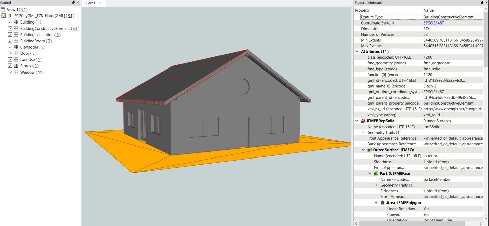
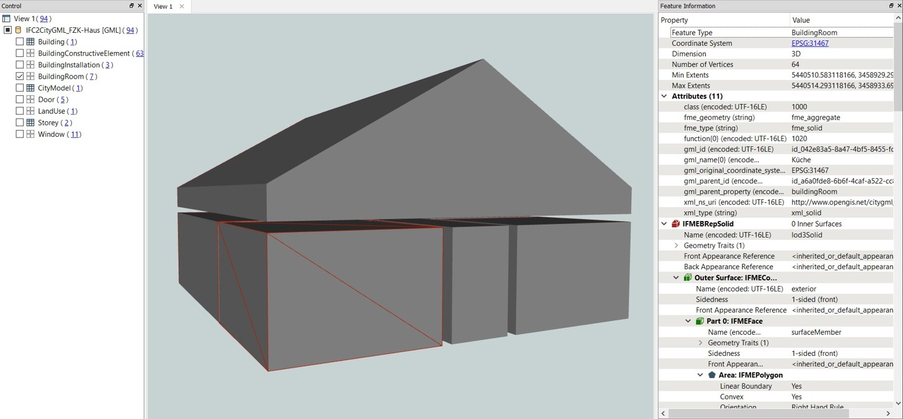
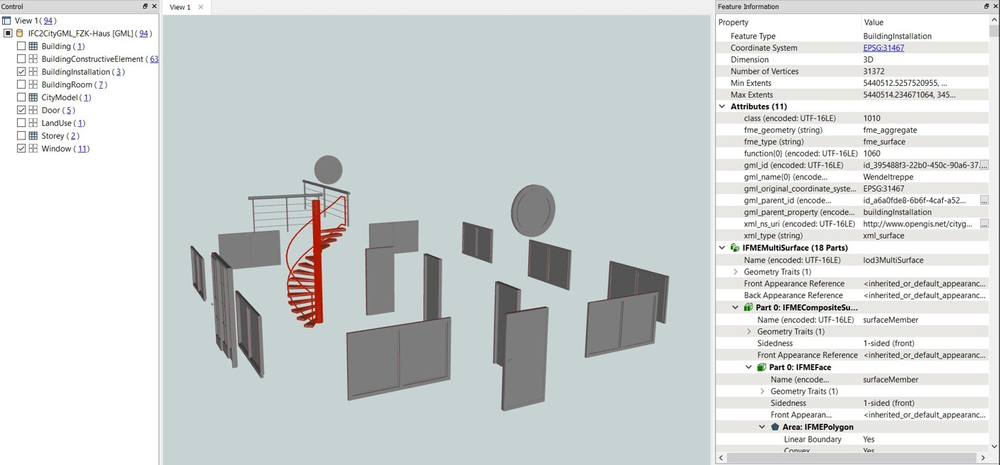
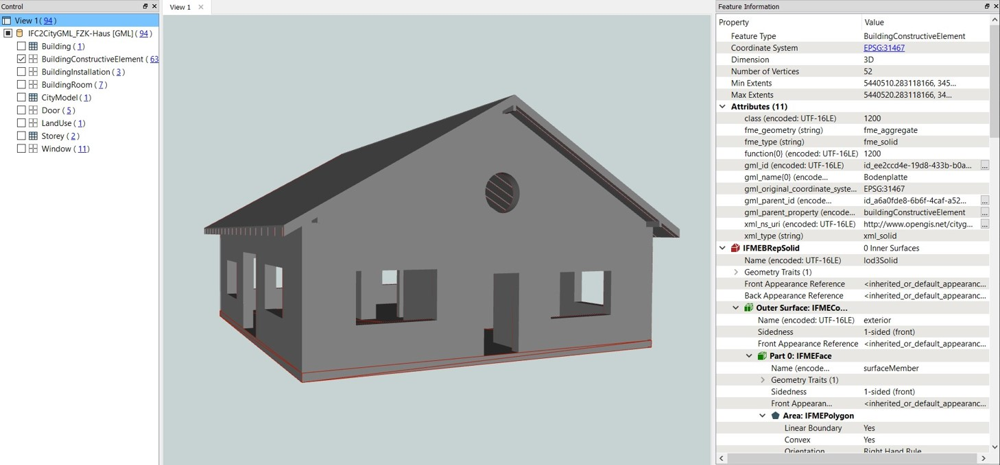

# citygml2-to-citygml3
An FME workspace for converting IFC data sets to CityGML 3.0 data sets.

## FME workspace
The FME workspace was created using FME 2019.0 (Build 19238).  
Opening the workspaces with other FME versions might lead to errors. 

The FME workspace makes use of the generic GML Writer to create the CityGML 3.0 data sets.

The CityGML 3.0 XML schemata required by the FME workspace are provided in the 'xsds' folder.  
The XML schemata are equivalent to the latest release on the [OGC CityGML 3.0 Encodings GitHub Release](https://github.com/opengeospatial/CityGML-3.0Encodings/releases) page.

Please note that the XML schemata are still under development and subject to change.  

## Test data sets
The workspace was tested using the "FZK Haus" data set from: http://www.ifcwiki.org/index.php?title=KIT_IFC_Examples  
The data set is provided in the 'input' folder of this repository.  
The CityGML 3.0 data set created by the FME workspace is available in the 'output' folder.

## Mapping of IFC objects to CityGML 3.0 objects
The table below shows the mapping of IFC objects to the corresponding objects in CityGML 3.0.  
The mapping makes use of the class 'BuildingConstructiveElement' that was newly introduced to CityGML 3.0 to allow for representing constructive elements from BIM datasets given in the IFC standard (e.g. the IFC classes 'IfcWall', 'IfcRoof', 'IfcBeam', 'IfcSlab', etc.) in CityGML.

| IFC objects         | CityGML 3.0 objects           |
| ------------------- | --------------------------- |
| IfcProject          | CityModel                   |
| IfcSite             | LandUse                     |
| IfcBuilding         | Building                    |
| IfcBuildingStorey   | Storey                      |
| IfcSpace            | BuildingRoom                |
| IfcWallStandardCase | BuildingConstructiveElement |
| IfcBeam             | BuildingConstructiveElement |
| IfcSlab             | BuildingConstructiveElement |
| IfcMember           | BuildingConstructiveElement |
| IfcDoor             | BuildingConstructiveElement |
| IfcWindow           | BuildingConstructiveElement |
| IfcRailing          | BuildingInstallation        |
| IfcStair            | BuildingInstallation        |

## Results
Below are some screenshots of the transformed 'FZKHaus' data set visualised using the FME Data Inspector 2019.0.

FZKHaus represented in CityGML 3.0:

FZKHaus - Rooms:

FZKHaus - BuildingInstallations, Doors, and Windows:

FZKHaus - BuildingConstructiveElements:

